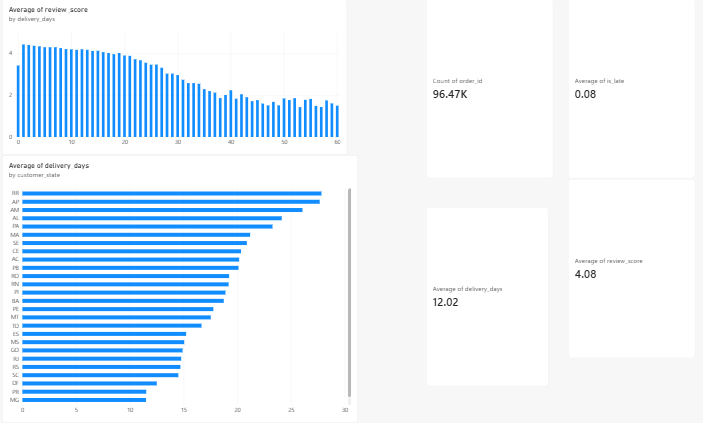

# E-Commerce Customer & Sales Intelligence

End-to-end analysis of the Olist Brazilian E-Commerce dataset (9 relational tables, ~96,500 delivered orders) to understand what drives customer satisfaction and retention — using SQL (multi-table joins), Power BI, and Python together.

## Tools used
- **SQL (SQLite)** — joined 6 tables (orders, customers, order items, products, reviews, payments) into one analysis-ready view; wrote 7 core business-question queries
- **Power BI** — interactive dashboard (review score vs. delivery time, delivery time by state, KPIs)
- **Python (pandas)** — repeat purchase / customer retention analysis

## Key findings

1. **Late delivery is the strongest driver of bad reviews.** On-time orders average 4.21 stars; late orders drop to 2.55 stars.
2. **The decline is steep, not gradual.** Reviews fall from 4.33 stars (0-7 day delivery) to 2.98 stars (22+ days) — the drop accelerates sharply past ~3 weeks.
3. **Delivery performance varies sharply by region.** São Paulo averages 8.3 days; remote states like Roraima (RR) and Amapá (AP) average 20-25+ days.
4. **Bed_bath_table has a satisfaction problem despite strong sales** — 2nd highest revenue category but the lowest review score among top categories.
5. **Credit card + installments dominate** — 77% of orders, averaging 3.6 installments, pointing to reliance on installment financing.
6. **Repeat purchase rate is extremely low: only 3%** of customers ever place a second order (using the correct customer_unique_id — customer_id is unique per order, a data trap this project specifically checked for).
7. **Review score is a weak predictor of repeat purchase** (2.4% vs 3.2% repeat rate across the review score range) — the low repeat rate appears to be a structural pattern, not something delivery speed alone would fix.

## Recommendations
- Prioritize delivery reliability, especially for remote/high-delay states (RR, AP, AM).
- Investigate the bed_bath_table category specifically for quality/shipping issues.
- Treat retention as a separate initiative from satisfaction — improving delivery will raise review scores but is unlikely to meaningfully raise the 3% repeat purchase rate on its own.

## Project structure
```
data/           raw CSVs + the joined, cleaned dataset
sql/            table-joining view + analysis queries
python/         repeat purchase / retention analysis
insights.md     full write-up of all 7 findings
E-Commerce.pbix Power BI dashboard
```

## Dashboard preview


## Dataset
[Brazilian E-Commerce Public Dataset by Olist (Kaggle)](https://www.kaggle.com/datasets/olistbr/brazilian-ecommerce)
